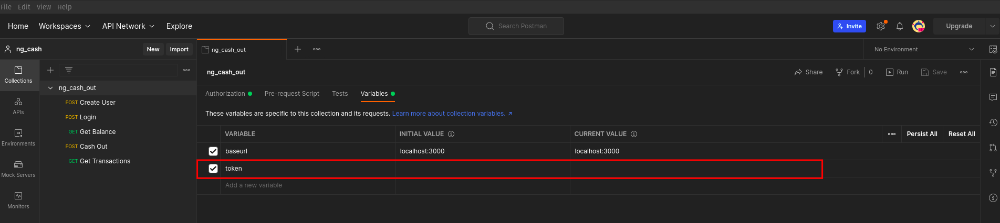

# ng-cash-out

**_API de transações cash-out para os usuário internos do NG Cash_**

## Sobre o projeto

Esta API tem como objetivo possibilitar que os usuários da NG Cash consigam:

- Realizar transações entre sí
- Verificar seu balance atual
- Visualizar todas a transações no qual seu usuário participou. Podendo filtrar pelo tipo de operação (cash-out ou cash-in) e/ou data na qual a transação foi realizada

## Pré-Requisitos

- [Node JS](https://nodejs.org/en/)
- [Yarn](https://yarnpkg.com/)
- [PostgreSQL](https://www.postgresql.org/)
- [Docker](https://www.docker.com/)

---

## Executando a aplicação

### Localmente

#### Criação do .env
O arquivo .env é utilizado em ambiente local e Docker. Sendo necessário configurá-lo de acordo com o ambiente desejado.

```bash
cp .env.example .env
```

#### Configuração da variáveis de ambiente

```bash
# .env
DB_HOST=localhost
DB_PORT=5432
DB_USER=postgres
DB_PASS=postgres
DB_NAME=ngCash

PORT=3000 # Porta da execução do node
SECRET=secretValue # Token utilizado pelo JWT
```

#### Instalação das Dependências

```bash
yarn
```

#### Execução do Yarn

```bash
yarn migration:run

yarn dev
```

---

### Docker

#### Criação do .env
O arquivo .env é utilizado em ambiente local e Docker. Sendo necessário configurá-lo de acordo com o ambiente desejado.

```bash
cp .env.example .env
```

#### Configuração da variáveis de ambiente

```bash
# .env
DB_HOST=db_postgres
DB_PORT=5432
DB_USER=postgres
DB_PASS=postgres
DB_NAME=ngCash

PORT=3000 # Porta da execução do node
SECRET=tZKoz0sSKdwr3DzrQuJI04oX6y1lKkbD # Token utilizado pelo JWT
```

#### Instalação das Dependências

```bash
yarn
```

#### Execução do Docker

```bash
# Sobe os containers
docker compose up -d --build

# Atualiza o banco de dados com as migrations
docker compose run app_node yarn migration:run
```

---

## Rotas da aplicação
Todas essas rotas podem ser consumidas através da url: `localhost:3000`.

Para facilitar o consumo da API, importe o arquivo `ng_cash_out.postman_collection.json` no Postman.

### Rotas com Sem Autenticação

#### Criar um usuário:

`POST` em `/users`, com o corpo:

```json
{
  "username": "@GabrielMartins", // Deve conter pelo menos 3 caracteres
  "password": "TesteSenha1" // Deve conter pelo menos 8 caracteres, contendo uma letra Maiuscula e um numero
}
```

#### Realizar Login:

`POST` em `/login`, com o corpo:

```json
{
  "username": "@GabrielMartins",
  "password": "TesteSenha1"
}
```


### Rotas com Autenticação
Todas as rotas a seguir utilizam o header `Authorization`, do tipo `Bearer Token`, **utilizar token gerado no login.**

**OBS:** Adicionar token gerado no login, na variável `token` da collection `ng_cash-out` 



#### Obter Balance:
`Get` em `/balance`, não possui corpo.

#### Realizar transação cash-out:

`POST` em `/cashOut`, com o corpo:

```json
{
    "recipientUsername": "@CamilaLaureano", // Usuário recebedor
    "value": 20 // Valor da transferencia
}
```

#### Obter transações do usuário:


`GET` em `/transaction`, com o corpo:

```json
{
    "operation": "cash-out", // Tipo da operação. É um parametro opcional, podendo ser "cash-out" ou "cash-in"
    "date": "20-11-2022" // Data de realização da transação. É um parametro opcional, que deve conter o formato "DD-MM-AAAA".
}
```
**OBS:** É necessário passar pelo um filtro para obter as transações. Filtros disponíveis: "operation" e "date"

---

## Construido com
- [bcrypt](https://www.npmjs.com/package/bcrypt)
- [dayjs](https://www.npmjs.com/package/dayjs)
- [dotenv](https://www.npmjs.com/package/dotenv)
- [express](https://www.npmjs.com/package/express)
- [express-async-errors](https://www.npmjs.com/package/express-async-errors)
- [jsonwebtoken](https://www.npmjs.com/package/jsonwebtoken)
- [pg](https://www.npmjs.com/package/pg)
- [reflect-metadata](https://www.npmjs.com/package/reflect-metadata)
- [typeorm](https://www.npmjs.com/package/typeorm)

## Autor
- **Gabriel Martins** - Desenvolvedor Back-End - gabrielmartinsdesouzaa@hotmail.com

## Licença
Este projeto está sob a licensa MIT. Veja o arquivo `LICENSE` para mais informações.
